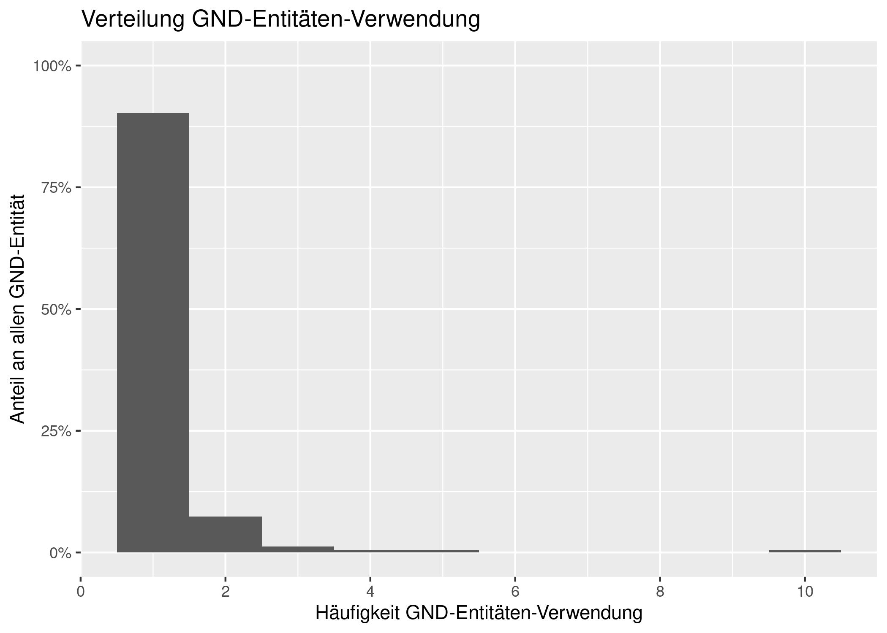

# Verwendung von pica-rs zur Datenanalyse mit RMarkdown

Beispielhaft wird in diesem Tutorial demonstriert, wie das Toolkit
pica-rs für Datenanalysen mit
[RMarkdown](https://rmarkdown.rstudio.com/) eingesetzt werden kann.
Datenabfrage mit `pica-rs` und Datenanalyse mit `R` können so in einem
gemeinsamen Dokument kombiniert werden.

``` r
# Setup: 
# Globale Einstellungen für das Ausführen von Code-Blöcken durch knitr
knitr::opts_chunk$set(echo = TRUE, message = FALSE, dev="jpeg", dpi = 300, fig.path = "plots/")
# Laden von R-Paketen
library(tidyverse) # beinhaltet u.a. readr, dplyr und ggplot2
```

## Datenabfrage

Zunächst erzeugen wir mit folgender Pica-Abfrage von der Datei
`testdaten.dat` eine CSV-Datei mit allen Tupeln aus Titel-idn und
GND-Entität-idn. Um die GND-Entitäten abzurufen, die mit einem
Titeldatensatz verknüpft sind, muss das Listenfeld `041A` mit
`pica select` ausgelesen werden. Sind mehrere GND-Entitäten in einem
Titel-Datensatz vohanden, expandiert `pica select` diese automatisch,
d.h. im Output `title_idn_gnd_idn.csv` kommen auch IDN-Nummern von
Titeln ggf. mehrfach vor (je eine Zeile pro GND-Entität).

``` bash
pica select -s --no-empty-columns -H "idn_titel, idn_sw"  "003@.0,041A/*.9" \
  ../testdaten.dat  -o title_idn_gnd_idn.csv 
```

Die Datei `title_idn_gnd_idn.csv` kann ggf. auch nur temporär erzeugt
werden, wenn ein Zwischenspeichern des Outputs von `pica-rs`nicht
gewünscht ist. Das Einlesen der Date in R erfolgt über die üblichen
Funktionen, z.B. aus dem `tidyverse`-Unterpaket `readr`.

``` r
title_idn_gnd_idn <- read_csv("title_idn_gnd_idn.csv", 
                              col_types = list(
                                idn_titel = col_factor(),
                                idn_sw = col_factor()))
```

## Datenanalyse

Wir wollen die abgefragten Daten im Folgenden beispielhaft analysieren:
Zunächst erzeugen wir eine zusammenfassende Zählstatistik:

``` r
count_summary <- title_idn_gnd_idn %>% 
  summarise(
    n_title = n_distinct(idn_titel), 
    n_terms = n_distinct(idn_sw)
    )
```

In dem so erzeugten Datensatz gibt es 245 verschiedene GND-Entitäten,
die an mindestens einen von 103 verschiedenen Titel-Datensätzen vergeben
wurden.

Als nächstes beantworten wir die Frage, wie viele GND-Entitäten pro
Titel im Durchschnitt verwendet werden:

``` r
sw_per_title <- title_idn_gnd_idn %>% 
  group_by(idn_titel) %>% 
  summarise(n_sw = n())

card_d <- sw_per_title %>% 
  summarise(
    n_title = n(), 
    avg_count = sum(n_sw)/n_title
    ) %>% 
  pull(avg_count)
```

Im Mittel liegen 2.77 GND-Entitäten pro Titel vor.

Wir wollen nun die IDN-Nummern der am häufigsten verwendeten
GND-Entitäten ausgeben:

``` r
gnd_term_freq <- title_idn_gnd_idn %>% 
  group_by(idn_sw) %>% 
  summarise(freq = n()) %>% 
  arrange(desc(freq))

head(gnd_term_freq, n = 10) %>% 
  knitr::kable()
```

| idn_sw    | freq |
|:----------|-----:|
| 040118827 |   10 |
| 040305503 |    5 |
| 040538818 |    4 |
| 041245113 |    3 |
| 041248538 |    3 |
| 041879635 |    3 |
| 040509265 |    2 |
| 040013073 |    2 |
| 118636405 |    2 |
| 040526925 |    2 |

## Datenvisualisierung

Über alle Schlagwörter betrachtet sieht die Verteilung der
GND-Entitäten-Verwendung wie folgt aus:

``` r
g <- ggplot(gnd_term_freq, aes(x = freq)) + 
  geom_histogram(aes(y = (..count..)/sum(..count..)), binwidth = 1) + 
  scale_y_continuous(labels = scales::percent, limits = c(0,1)) + 
  scale_x_continuous(breaks = c(0,2,4,6,8,10)) + 
  xlab("Häufigkeit GND-Entitäten-Verwendung") + 
  ylab("Anteil an allen GND-Entität") + 
  ggtitle("Verteilung GND-Entitäten-Verwendung")

g
```



Das Histogramm zeigt, dass die meisten GND-Entitäten nur einmal
verwendet werden. Einzelne Terme werden aber auch bis zu 10-mal
verwendet.

Eine andere Visualisierungsform des gleichen Sachverhalts ist Folgende:

``` r
gnd_term_freq <- gnd_term_freq %>%
  mutate(index = 1:n())

ggplot(gnd_term_freq, aes(x = index, y = freq)) +
    geom_point() +
    scale_y_log10() +
    ylab("Häufigkeit je GND-Entität") +
    xlab("Index GND-Entitäten (sortiert nach Häufigkeit)") + 
    ggtitle("Long-Tail Darstellung")
```


## Dieses Tutorial selbst ausführen

Um das hier vorgestellte Tutorial selbst auszuführen, stehen im
offiziellen github-Repository des Toolkits pica-rs die  
[.rmd-Quelldatei](https://github.com/deutsche-nationalbibliothek/pica-rs/blob/main/docs/book/src/de/tutorials/rmarkdown/rmarkdown.rmd)
sowie ein [Testdatensatz im PICA+
Format](https://github.com/deutsche-nationalbibliothek/pica-rs/blob/main/docs/book/src/de/tutorials/testdaten.dat)
für dieses Tutorial zum Download zur Verfügung.
